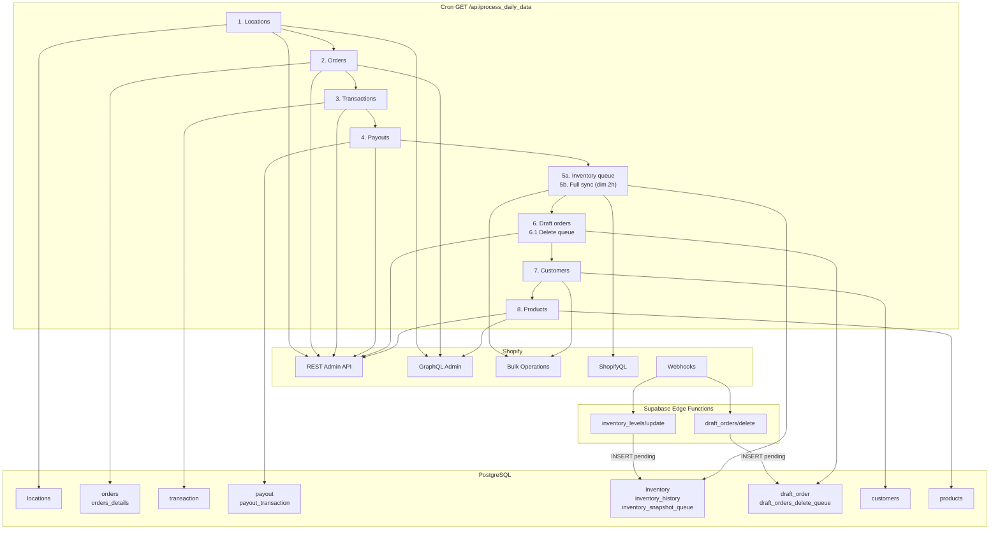

# Pipeline Shopify → PostgreSQL

Ce document decrit l'ensemble du pipeline ETL qui extrait les donnees de Shopify (REST Admin API, GraphQL Admin API, ShopifyQL, webhooks) et les stocke dans PostgreSQL (Supabase).

---

## Table des matieres

1. [Vue d'ensemble](#1-vue-densemble)
2. [Contexte d'execution](#2-contexte-dexecution)
3. [Webhooks Supabase Edge (Deno)](#3-webhooks-supabase-edge-deno)
4. [Etape 1 — Locations](#4-etape-1--locations)
5. [Etape 2 — Commandes (orders)](#5-etape-2--commandes-orders)
6. [Etape 3 — Transactions financieres](#6-etape-3--transactions-financieres)
7. [Etape 4 — Versements Shopify Payments (payouts)](#7-etape-4--versements-shopify-payments-payouts)
8. [Etape 5 — Inventaire](#8-etape-5--inventaire)
9. [Etape 6 — Draft orders](#9-etape-6--draft-orders)
10. [Etape 7 — Customers](#10-etape-7--customers)
11. [Etape 8 — Produits](#11-etape-8--produits)
12. [Variables d'environnement et versions d'API](#12-variables-denvironnement-et-versions-dapi)
13. [Limites connues et dette technique](#13-limites-connues-et-dette-technique)

---

## 1. Vue d'ensemble

Le pipeline est orchestre par `api/process_daily_data.py`, expose comme endpoint HTTP **GET** derriere un cron Vercel. Il execute sequentiellement huit etapes de synchronisation.

En parallele, deux **Edge Functions Deno** hebergees sur Supabase recoivent les webhooks Shopify en temps reel et ecrivent dans des tables de file d'attente (queues) que le cron traite ensuite.



---

## 2. Contexte d'execution

### Point d'entree

La classe `handler` dans `api/process_daily_data.py` expose un endpoint GET protege par `Authorization: Bearer {CRON_SECRET}`.

### Fenetre temporelle

`api/lib/utils.py` → `get_dates()` calcule automatiquement la plage :

| Borne | Valeur |
|-------|--------|
| `start_date` | Hier, arrondi au debut de l'heure (UTC+2) |
| `end_date` | Maintenant + 1 heure, arrondi au debut de l'heure (UTC+2) |

Cette plage est passee a toutes les fonctions de synchronisation par periode (orders, transactions, draft orders).

### Contexte multi-boutique

`get_store_context()` retourne trois champs injectes dans chaque enregistrement insere :

| Champ | Variable d'env | Usage |
|-------|---------------|-------|
| `data_source` | `DATA_SOURCE` (defaut `"Shopify"`) | Origine des donnees |
| `company_code` | `COMPANY_CODE` | Code societe |
| `commercial_organisation` | `COMMERCIAL_ORGANISATION` | Organisation commerciale |

---

## 3. Webhooks Supabase Edge (Deno)

Deux Edge Functions Deno traitent les webhooks Shopify de maniere asynchrone, en avance du cron. Elles ecrivent dans des tables de file d'attente que le cron Python consomme ensuite.

### 3.1. Webhook `inventory_levels/update`

**Declencheur** : Shopify envoie un evenement a chaque modification de stock (changement de quantite sur un couple `inventory_item_id` / `location_id`).

#### Verification HMAC

Le webhook supporte **plusieurs secrets** d'application simultanes (migration sans downtime). Les secrets sont fournis via `SHOPIFY_APP_SECRETS` (CSV). Au demarrage du module, les `CryptoKey` sont pre-importees une seule fois pour eviter le cout de `importKey` a chaque requete. La verification HMAC est lancee en parallele sur tous les secrets via `Promise.all(keys.map(k => crypto.subtle.verify(...)))`.

Les requetes sans header `X-Shopify-Hmac-Sha256` (probes Shopify) recoivent un `200 OK` sans traitement.

#### Enrichissement GraphQL

Apres verification, le webhook effectue un appel GraphQL immediat pour obtenir un snapshot complet des quantites :

```
query($id: ID!) {
  inventoryLevel(id: $id) {
    id updatedAt
    location { id name }
    item { id }
    quantities(names: ["available","on_hand","incoming","committed","reserved"]) {
      name quantity
    }
  }
}
```

#### Insertion dans la queue

Les donnees enrichies sont inserees dans `inventory_snapshot_queue` :

| Colonne | Source |
|---------|--------|
| `shop` | Header `X-Shopify-Shop-Domain` |
| `webhook_id` | Header `X-Shopify-Webhook-Id` (cle d'idempotence via contrainte UNIQUE) |
| `topic` | Header `X-Shopify-Topic` |
| `inventory_item_id` | `payload.inventory_item_id` (converti en numeric) |
| `location_id` | `payload.location_id` (converti en numeric) |
| `inventory_level_id` | GID depuis `inventoryLevel.id` (GraphQL) |
| `location_name` | `inventoryLevel.location.name` (GraphQL) |
| `shopify_updated_at` | `inventoryLevel.updatedAt` (GraphQL) |
| `quantities` | JSON des quantites (GraphQL) |
| `raw_payload` | Payload brut du webhook |
| `status` | `'pending'` |

### 3.2. Webhook `draft_orders/delete`

**Declencheur** : Shopify envoie un evenement quand un draft order est supprime.

La verification HMAC est identique (memes secrets multi-application). Le payload est insere dans `draft_orders_delete_queue` :

| Colonne | Source |
|---------|--------|
| `shop` | Header `X-Shopify-Shop-Domain` |
| `webhook_id` | Header `X-Shopify-Webhook-Id` (idempotence) |
| `topic` | Header `X-Shopify-Topic` |
| `api_version` | Header `X-Shopify-API-Version` |
| `matched_index` | Index du secret qui a matche |
| `draft_order_id` | `payload.id` |
| `raw_payload` | Payload complet |
| `status` | `'pending'` |

---

## 4. Etape 1 — Locations

**Fichier** : `api/lib/location_processor.py`

### Source Shopify

| API | Route | Parametres |
|-----|-------|-----------|
| REST | `GET /admin/api/{version}/locations.json` | Aucun filtre de date (l'API ne supporte pas `created_at_min`) |
| GraphQL | `POST .../graphql.json` requete `nodes(ids:)` sur `Location` | Batch de 50 IDs, recupere `metafields(first: 25)` |

### Transformations

1. **Filtrage client** : Comme l'API REST locations ne supporte pas de filtre par date, toutes les locations sont recuperees puis filtrees en Python sur `created_at > since_datetime` (date de la derniere location en base).

2. **Enrichissement metafields** : Pour chaque location, un appel GraphQL batch recupere tous les metafields. Les metafields sont agreges en un objet JSON `{namespace.key: value}`, et le champ `custom.email` est extrait separement.

### Table cible : `locations`

Cle primaire : `_location_id` (UPSERT via `ON CONFLICT`).

Colonnes principales : `name`, `active`, `address1`, `city`, `province`, `province_code`, `country`, `country_code`, `zip`, `phone`, `email`, `legacy`, `admin_graphql_api_id`, `created_at`, `updated_at`, `synced_at`, `metafields` (JSONB).

---

## 5. Etape 2 — Commandes (orders)

### 5.1. Recuperation des commandes

**Fichier** : `api/lib/shopify_api.py` → `get_daily_orders()`

| API | Route | Parametres |
|-----|-------|-----------|
| REST | `GET /admin/api/{version}/orders.json` | `status=any`, `updated_at_min`, `updated_at_max`, `limit=250` |

La pagination est geree via le header `Link` (`rel="next"`). A chaque page suivante, les `params` sont vides (l'URL paginee contient deja les filtres).

### 5.2. Enrichissement metafields

**Fichier** : `api/lib/shopify_api.py` → `fetch_order_metafields()`

| API | Route | Parametres |
|-----|-------|-----------|
| GraphQL | `POST .../graphql.json` requete `nodes(ids:)` sur `Order` | Batch de 100 IDs, metafield `custom.order_type` |

Pour chaque commande, la valeur du metafield `order_type` est injectee comme `_metafield_order_type` dans l'objet order avant le traitement.

### 5.3. Traitement et insertion

**Fichiers** : `api/lib/order_processor.py` + `api/lib/insert_order.py`

#### Filtrage des commandes de test

Les commandes taggees `TEST_order_Shopify` sont detectees et **supprimees** de la base (tables `transaction`, `orders_details`, `orders`) si elles existaient. Leur `order_id` est ajoute a `orders_id_to_skip` pour eviter de les retraiter a l'etape transactions.

#### Mapping Shopify → `orders`

Le JSON Shopify est mappe vers les colonnes de la table `orders`. Parmi les transformations notables :

| Champ Shopify | Transformation | Colonne |
|---------------|---------------|---------|
| `tags` | Parse en liste via `parse_tags_to_list()` | `tags_list` (JSON array) |
| `tags` | Extraction `US` ou `JP` (defaut `US`) | `market` |
| `tags` (pattern `STORE_{name}_{id}`) | Extraction du dernier segment numerique | `source_location` |
| `_metafield_order_type` (enrichi) | Valeur directe | `order_type` |
| `cancelled_at` | Non-null → `"CANCELLED"` | `cancel_status` |
| `current_total_price - shipping - taxes` | Calcul derive | `net_sales` |
| `returns / (1 + sum(tax_rates))` | Calcul derive | `returns_excl_taxes` |
| `billing_address > *`, `shipping_address > *` | Navigation imbriquee via `get_nested_value()` | `billing_*`, `shipping_*` |
| `tax_lines[0..4]` | Jusqu'a 5 taxes extraites | `tax1_name`, `tax1_rate`, `tax1_value_origin`, ... |

**Strategie d'ecriture** : `INSERT ... ON CONFLICT (_id_order) DO UPDATE SET ...` (upsert complet).

#### Mapping Shopify → `orders_details`

Chaque `line_item` de la commande genere une ligne dans `orders_details`. Transformations notables :

| Champ | Transformation | Colonne |
|-------|---------------|---------|
| `price * quantity` | Calcul | `amount_gross_sales` |
| `(quantity - current_quantity) * price` | Calcul | `amount_returns` |
| `(pre_tax_price - price) * current_quantity` | Calcul | `amount_discounts` |
| `current_quantity * pre_tax_price` | Calcul | `amount_net_sales` |
| Si `amount_returns != 0` et status `unfulfilled` | Correction | `fulfillment_status = 'fulfilled'` |
| `tax_lines[0..4]` | Jusqu'a 5 taxes par article | `tax1_name`, `tax1_rate`, `tax1_value` |

**Strategie d'ecriture** : `INSERT ... ON CONFLICT (_id_order_detail) DO UPDATE SET ...`

---

## 6. Etape 3 — Transactions financieres

**Fichier** : `api/lib/process_transactions.py`

Cette etape decompose chaque commande en lignes comptables granulaires (ventes, remises, taxes, remboursements, paiements, frais de port, duties, gift cards, tips).

### 6.1. Recuperation des commandes

| API | Route | Parametres |
|-----|-------|-----------|
| REST | `GET /admin/api/2024-10/orders.json` | `updated_at_min`, `updated_at_max`, `status=any` |

Les commandes presentes dans `orders_id_to_skip` (commandes de test filtrees a l'etape 2) sont ignorees.

### 6.2. Decomposition par commande

Pour chaque `order_id`, la fonction `get_transactions_by_order()` effectue deux appels REST :

| API | Route | Donnees extraites |
|-----|-------|-------------------|
| REST | `GET /admin/api/2024-10/orders/{id}.json` | Commande complete (fulfillments, refunds, line items, taxes) |
| REST | `GET /admin/api/2024-10/orders/{id}/transactions.json` | Transactions financieres (split tender, Shop Pay Installments) |

La premiere transaction avec `status=success` fournit le `payment_method_name` utilise pour toutes les lignes.

### 6.3. Types de transactions generees

Chaque commande est decomposee en plusieurs types de transactions :

| Type | `account_type` | Description |
|------|----------------|-------------|
| `sales_gross` | `Sales` | Vente brute HT par article (`price * quantity`) |
| `discount_line` | `Discounts` | Remise par article (montant negatif) |
| `tax_line` | `Taxes` | Taxe par article et par ligne fiscale |
| `refund_line` | `Returns` | Remboursement d'article (via `refunds[].refund_line_items`) |
| `refund_tax` | `Returns` | Remboursement de taxes |
| `refund_financial` | `Refunds` | Remboursement financier global |
| `unfulfilled_line` | `Sales` | Article non expede (pas de fulfillment) |
| `payment` / `refund_payment` | `Payments` / `Refunds` | Transactions financieres depuis `transactions.json` |

Des fonctions d'extraction supplementaires generent des transactions separees :

| Fonction | Types generes |
|----------|--------------|
| `extract_duties_transactions()` | Duties, taxes sur duties, remboursements de duties |
| `extract_shipping_transactions()` | Frais de port, taxes sur frais de port |
| `extract_gift_card_transactions()` | Applications de cartes cadeaux |
| `extract_tips_transactions()` | Pourboires |

### 6.4. Multi-devise

Chaque transaction porte un montant en devise boutique (`shop_amount`, `shop_currency`) et en devise presentment (`amount_currency`, `transaction_currency`). Le taux de change `exchange_rate` est calcule par division.

### 6.5. COGS (Cost of Goods Sold)

`add_cogs_to_transaction()` enrichit chaque transaction de type vente ou remboursement avec `cogs_unit` et `cogs_total` en recuperant le cout unitaire depuis la table `products`.

### 6.6. Persistance

**Strategie d'ecriture** : pour chaque batch, toutes les transactions existantes des `order_id` concernes sont **supprimees** (`DELETE FROM transaction WHERE order_id IN (...)`) avant reinsertion. Les transactions sont triees par date avant insertion.

**Table cible** : `transaction`

Colonnes principales : `date`, `order_id`, `client_id`, `account_type`, `transaction_description`, `shop_amount`, `amount_currency`, `transaction_currency`, `location_id`, `source_name`, `status`, `product_id`, `variant_id`, `payment_method_name`, `orders_details_id`, `quantity`, `exchange_rate`, `shop_currency`, `cogs_unit`, `cogs_total`.

---

## 7. Etape 4 — Versements Shopify Payments (payouts)

**Fichier** : `api/lib/process_payout.py`

### 7.1. Recuperation des versements du jour

| API | Route | Parametres |
|-----|-------|-----------|
| REST | `GET /admin/api/2024-10/shopify_payments/payouts.json` | `limit=50`, `status=paid`, `date={YYYY-MM-DD}` |

Pour chaque payout, trois enrichissements supplementaires :

| Fonction | Route REST | Donnees |
|----------|-----------|---------|
| `obtenir_details_versement()` | `balance/transactions.json?payout_id={id}` puis fallback `payouts/{id}.json` | `bank_reference` |
| `obtenir_transactions_versement()` | `payouts/{id}/transactions.json?limit=250` | Liste des transactions du versement |
| `_fetch_payment_method_name()` | `orders/{oid}/transactions/{txid}.json` (par transaction) | `payment_method_name` via `payment_details` |
| `obtenir_details_commande()` | `orders/{id}.json` | `order.name` pour le libelle |

### 7.2. Transformations

Pour chaque transaction du versement, les champs suivants sont calcules :

| Champ | Calcul |
|-------|--------|
| `amount` | `float(tx.amount)` |
| `fee` | `float(tx.fee)` |
| `net` | `amount - fee` |
| `charges_total` | Somme des `amount` ou `type == "charge"` |
| `refunds_total` | Somme des `amount` ou `type == "refund"` |

### 7.3. Persistance

**Strategie d'ecriture** : Si un payout existe deja, ses transactions sont supprimees puis le payout est supprime avant reinsertion (delete + insert).

**Tables cibles** :

| Table | Cle | Colonnes principales |
|-------|-----|---------------------|
| `payout` | `id` | `date`, `status` (`"Deposited"`), `total`, `bank_reference`, `charges_total`, `refunds_total`, `fees_total`, `currency` |
| `payout_transaction` | `id` | `payout_id`, `date`, `order_id`, `order_name`, `type`, `amount`, `fee`, `net`, `currency`, `payment_method_name` |

---

## 8. Etape 5 — Inventaire

L'inventaire utilise trois mecanismes complementaires pour garantir la coherence des donnees.

### 8.1. Traitement de la queue webhook (etape 5a du cron)

**Fichier** : `api/lib/process_inventory_sync.py` → `process_inventory_queue()`

Cette fonction consomme les lignes `pending` (ou `failed` avec `attempts < 6`) de `inventory_snapshot_queue`, inserees par le webhook Deno (section 3.1).

#### Phase A : UPSERT dans `inventory`

Pour chaque ligne de la queue :

1. Le statut passe a `'processing'` avec incrementage des `attempts`.
2. Le champ `quantities` (JSON) est decompose en colonnes numeriques :

| Champ JSON | Colonne |
|-----------|---------|
| `quantities.available` | `available` |
| `quantities.committed` | `committed` |
| `quantities.on_hand` | `on_hand` |
| `quantities.incoming` | `incoming` |
| `quantities.reserved` | `reserved` |

3. Insertion via `INSERT ... ON CONFLICT (inventory_item_id, location_id) DO UPDATE SET ...`. Le `RETURNING (xmax = 0) AS inserted` permet de distinguer insertion et mise a jour.
4. En cas de succes : `status = 'completed'`. En cas d'echec apres 3 tentatives : `status = 'failed'`.

#### Phase B : ShopifyQL → `inventory_history`

**Fichiers** : `api/lib/shopifyql_helpers.py`

Pour chaque couple `(inventory_item_id, location_id)` traite avec succes en Phase A, le systeme interroge ShopifyQL pour recuperer les ajustements du jour :

```sql
FROM inventory_adjustment_history
SHOW
  inventory_item_id, inventory_location_name,
  inventory_adjustment_change, inventory_adjustment_count,
  inventory_change_reason, reference_document_type,
  reference_document_uri, inventory_state, second
GROUP BY second, inventory_item_id, inventory_location_name, ...
HAVING inventory_adjustment_change != 0
SINCE {today} UNTIL {tomorrow}
WHERE inventory_item_id = {id} AND inventory_location_name = '{name}'
ORDER BY second ASC
LIMIT 500
```

Transformations pour l'insertion dans `inventory_history` :

1. **Deduplication** : ShopifyQL retourne parfois des doublons. Une cle composite `(item_id, timestamp, state, reason, change)` est utilisee pour deduplication.

2. **Evenements synthetiques de fulfillment** : `_fetch_synthetic_fulfillment_events()` detecte les fulfillments manquants dans les donnees ShopifyQL en interrogeant l'API REST (`orders/{id}.json`) pour chaque commande referencee. Si un fulfillment a eu lieu mais n'apparait pas dans ShopifyQL (decalage), un evenement synthetique `committed -qty` est genere.

3. **Calcul des valeurs absolues** : Le stock absolu est reconstitue par replay :
   - `initial_state = current_stock - total_delta` (ou `current_stock` vient de la table `inventory`)
   - Chaque evenement incremente le running state du champ `inventory_state` correspondant.
   - Un mecanisme de "negative-shift fallback" decale l'etat initial vers le haut si le replay produirait des valeurs negatives.

4. **Insertion** : Chaque timestamp produit une ligne dans `inventory_history` avec les colonnes : `available`, `committed`, `damaged`, `incoming`, `on_hand` (somme de tous les etats), `quality_control`, `reserved`, `safety_stock`, `available_stock_movement`, `change_type` (`'ADJUSTMENT'`), `change_comment`.

### 8.2. Full sync hebdomadaire (etape 5b du cron)

**Fichier** : `api/lib/process_inventory_sync.py` → `sync_inventory_full()`

Active uniquement le **dimanche a 2h** (condition `weekday() == 6 and hour == 2`).

| API | Methode | Parametres |
|-----|---------|-----------|
| GraphQL | `bulkOperationRunQuery` | Tous les `inventoryItems` sans filtre de date |

La requete bulk recupere pour chaque item :
- `id`, `legacyResourceId`, `sku`, `tracked`, `updatedAt`, `unitCost { amount currencyCode }`
- `variant { id legacyResourceId displayName sku product { ... } }`
- `inventoryLevels(first: 250) { location { ... } quantities(names: [...]) scheduledChanges { ... } }`

Les types de quantites sont decouverts dynamiquement via `inventoryProperties { quantityNames }` et incluent generalement : `incoming`, `on_hand`, `available`, `committed`, `reserved`, `damaged`, `safety_stock`, `quality_control`.

Le resultat JSONL est streame puis transforme en enregistrements plats, un par couple `(inventory_item, location)`. L'insertion utilise `execute_values` en batch de 1000 avec la meme clause `ON CONFLICT (inventory_item_id, location_id)`.

**Raison d'etre** : Le filtre `updated_at` dans les bulk operations incrementales s'applique a l'`InventoryItem` global, pas aux `InventoryLevel` individuels. Un item peut donc avoir du stock dans une location sans que son `updated_at` change. Le full sync hebdomadaire rattrape ces cas.

### 8.3. Table `inventory`

Cle primaire composite : `(inventory_item_id, location_id)`.

Colonnes principales : `variant_id`, `product_id`, `sku`, `available`, `committed`, `damaged`, `incoming`, `on_hand`, `quality_control`, `reserved`, `safety_stock`, `last_updated_at`, `scheduled_changes`, `synced_at`.

### 8.4. Table `inventory_history`

Colonnes principales : `inventory_item_id`, `location_id`, `variant_id`, `product_id`, `sku`, `available`, `committed`, `damaged`, `incoming`, `on_hand`, `quality_control`, `reserved`, `safety_stock`, `available_stock_movement`, `recorded_at`, `change_type`, `change_comment`.

---

## 9. Etape 6 — Draft orders

**Fichier** : `api/lib/process_draft_orders.py`

### 9.1. Recuperation

| API | Route | Parametres |
|-----|-------|-----------|
| REST | `GET /admin/api/2024-10/draft_orders.json` | `updated_at_min`, `updated_at_max`, `limit=250` + pagination Link |

### 9.2. Decomposition en transactions

Chaque draft order est decompose en transactions par `process_draft_order()` :

Pour chaque `line_item` du draft order :

| Type | `account_type` | Description |
|------|----------------|-------------|
| `draft_order_item` | `Draft Orders` | Ligne produit : `price * quantity` |
| `draft_order_tax` | `Draft Orders Taxes` | Taxe par article : `tax.price * quantity` |

Transformations notables :

| Champ Shopify | Transformation | Colonne |
|---------------|---------------|---------|
| `tags` (pattern `STORE_{name}_{id}`) | `get_source_location(tags)` | `source_location` |
| `tags` | `_parse_tags_to_list()` | `tags_list` |
| `customer.id` | Defaut `-1` si absent | `client_id` |
| `status` | Valeur directe (`open`, `completed`, `invoice_sent`) | `status` |

### 9.3. Persistance

**Strategie d'ecriture** : Pour chaque `draft_id`, les transactions existantes sont supprimees (`DELETE FROM draft_order WHERE _draft_id = %s`) avant reinsertion.

**Table cible** : `draft_order`

Colonnes principales : `_draft_id`, `created_at`, `completed_at`, `order_id`, `client_id`, `product_id`, `type`, `account_type`, `transaction_description`, `amount`, `status`, `transaction_currency`, `source_name`, `quantity`, `source_location`, `sku`, `variant_id`, `variant_title`, `name`, `draft_order_name`, `draft_order_note`, `tags`, `tags_list`.

### 9.4. File de suppression (etape 6.1 du cron)

**Fichier** : `api/lib/process_draft_orders.py` → `process_draft_orders_delete_queue()`

Consomme les lignes `pending` (ou `failed` avec `attempts < 6`) de `draft_orders_delete_queue`, inserees par le webhook Deno (section 3.2).

Pour chaque entree :
1. Statut passe a `'processing'`, `attempts` incremente.
2. Mise a jour : `UPDATE draft_order SET status = 'deleted' WHERE _draft_id = {draft_order_id}`.
3. Succes → `status = 'completed'`, `processed_at = NOW()`.
4. Echec → `status = 'failed'`, `last_error` renseigne.

---

## 10. Etape 7 — Customers

**Fichier** : `api/lib/process_customer.py`

### 10.1. Recuperation via Bulk Operation

| API | Methode | Filtre |
|-----|---------|--------|
| GraphQL | `bulkOperationRunQuery` | `customers(query: "updated_at:>='{date}'")` |

La mutation lance une bulk operation filtree. Le module poll `currentBulkOperation` toutes les 5 secondes jusqu'a `COMPLETED`.

Le JSONL resultant est streame et parse. Les metafields arrivent comme des lignes JSONL separees avec `__parentId` pointant vers le GID du customer parent.

### 10.2. Transformations

`_build_customer_record()` construit l'enregistrement a partir du node JSONL :

| Champ Shopify | Transformation | Colonne |
|---------------|---------------|---------|
| `legacyResourceId` | Valeur directe | `customer_id` |
| `amountSpent { amount currencyCode }` | Extraction | `amount_spent`, `amount_spent_currency` |
| `addresses` | `json.dumps()` | `addresses` (JSON) |
| `emailMarketingConsent` | `json.dumps()` | `email_marketing_consent` (JSON) |
| `smsMarketingConsent` | `json.dumps()` | `sms_marketing_consent` (JSON) |
| `defaultAddress` | `json.dumps()` | `default_address` (JSON) |
| Metafields (lignes JSONL enfants) | Agrege en `{namespace.key: value}` | `metafields` (JSON) |

Certains champs texte sont tronques (`first_name`: 100, `email`: 255, `gid`: 255, etc.) pour respecter les contraintes de la table.

### 10.3. Persistance

**Table cible** : `customers`

Cle primaire : `customer_id`.

**Strategie d'ecriture** : `INSERT ... ON CONFLICT (customer_id) DO UPDATE SET ...` (upsert complet).

---

## 11. Etape 8 — Produits

**Fichier** : `api/lib/product_processor.py`

### 11.1. Recuperation des produits

| API | Route | Parametres |
|-----|-------|-----------|
| REST | `GET /admin/api/{version}/products.json` | `limit=250`, `fields=id,title,handle,status,...,variants,options,images`, `updated_at_min` optionnel |

Pagination via header `Link`, maximum 50 pages (limite de securite).

### 11.2. Extraction des variants

Chaque produit est decompose en variants. Pour chaque variant :

| Champ Shopify | Transformation | Colonne |
|---------------|---------------|---------|
| `variants[].id` | Valeur directe | `variant_id` |
| `variants[].inventory_item_id` | Valeur directe | `inventory_item_id` |
| `options` | Detection intelligente (`color`/`colour`/`couleur`, `size`/`taille`/`dimension`) | `value_color`, `value_size` |
| `images[0].src` | Premiere image du produit | `image_url` |

### 11.3. Enrichissement COGS via GraphQL

**Fonction** : `fetch_cogs_via_graphql()`

| API | Methode | Parametres |
|-----|---------|-----------|
| GraphQL | `POST .../graphql.json` requete `nodes(ids:)` sur `InventoryItem` | Batch de 250 IDs |

Pour chaque `InventoryItem`, le champ `unitCost { amount currencyCode }` est recupere. Fallback vers l'API REST (`GET /admin/api/{version}/inventory_items/{id}.json`) en cas d'echec GraphQL.

### 11.4. Persistance

**Table cible** : `products`

Cle primaire : `variant_id`.

**Strategie d'ecriture** : `INSERT ... ON CONFLICT (variant_id) DO UPDATE SET ...` par batch de 500 (`executemany`).

Colonnes principales : `variant_id`, `product_id`, `inventory_item_id`, `cogs`, `status`, `vendor`, `barcode`, `sku`, `value_color`, `value_size`, `title`, `price`, `compare_at_price`, `weight`, `weight_unit`, `position`, `product_title`, `product_handle`, `product_type`, `tags`, `image_url`.

---

## 12. Variables d'environnement et versions d'API

### Variables requises

| Variable | Usage |
|----------|-------|
| `SHOPIFY_STORE_DOMAIN` | Domaine Shopify (`xxx.myshopify.com`) |
| `SHOPIFY_ACCESS_TOKEN` | Token d'acces Admin API |
| `SHOPIFY_API_VERSION` | Version API (utilisee par certains modules) |
| `SHOPIFY_APP_SECRETS` | Secrets webhook (CSV, Deno uniquement) |
| `SHOPIFY_ADMIN_ACCESS_TOKEN` | Token Admin (Deno uniquement) |
| `DATABASE_URL` | URL de connexion PostgreSQL |
| `SUPABASE_USER`, `SUPABASE_PASSWORD`, `SUPABASE_HOST`, `SUPABASE_PORT`, `SUPABASE_DB_NAME` | Fallback si `DATABASE_URL` absent |
| `SB_URL`, `SB_SERVICE_ROLE_KEY` | Client Supabase (Deno uniquement) |
| `CRON_SECRET` | Secret d'authentification du cron |
| `DATA_SOURCE`, `COMPANY_CODE`, `COMMERCIAL_ORGANISATION` | Contexte multi-boutique |

### Versions d'API par module

Les modules ne partagent pas tous la meme version d'API, ce qui peut entrainer des differences de comportement :

| Module | Version | Mode |
|--------|---------|------|
| `shopify_api.py` | `SHOPIFY_API_VERSION` (env) | Dynamique |
| `location_processor.py` | `SHOPIFY_API_VERSION` (env, defaut `2024-10`) | Dynamique |
| `product_processor.py` | `SHOPIFY_API_VERSION` (env, defaut `2024-10`) | Dynamique |
| `process_transactions.py` | `2024-10` | **Figee** |
| `process_draft_orders.py` | `2024-10` | **Figee** |
| `process_payout.py` | `2024-10` | **Figee** |
| `process_inventory_sync.py` | `2025-01` | **Figee** |
| `process_customer.py` | `SHOPIFY_API_VERSION` (env, defaut `2025-01`) | Dynamique |
| `shopifyql_helpers.py` | `2026-01` | **Figee** |
| Webhook inventory (Deno) | `SHOPIFY_API_VERSION` (env, defaut `2024-10`) | Dynamique |

---

## 13. Limites connues et dette technique

### Pagination manquante sur `get_transactions_between_dates`

La fonction `get_transactions_between_dates()` dans `process_transactions.py` appelle `orders.json` sans gerer la pagination Link. Si plus de 250 commandes sont modifiees dans la fenetre temporelle, certaines commandes ne seront pas traitees. La fonction `get_daily_orders()` dans `shopify_api.py` gere correctement la pagination.

### Filtre `updated_at` sur InventoryItem vs InventoryLevel

Le filtre `updated_at` des bulk operations incrementales s'applique a l'`InventoryItem` parent et non aux `InventoryLevel` enfants. Un item peut avoir du stock dans une location sans que son `updated_at` change. Cela est compense par les webhooks temps reel et le full sync hebdomadaire du dimanche.

### Fuseau horaire code en dur

`get_dates()` utilise `UTC+2` en dur, ce qui peut produire des resultats inattendus lors des changements d'heure ete/hiver.

### Versions d'API divergentes

Plusieurs modules utilisent des versions figees differentes (`2024-10`, `2025-01`, `2026-01`). Cela peut entrainer des incoherences si un champ change de comportement entre les versions.
